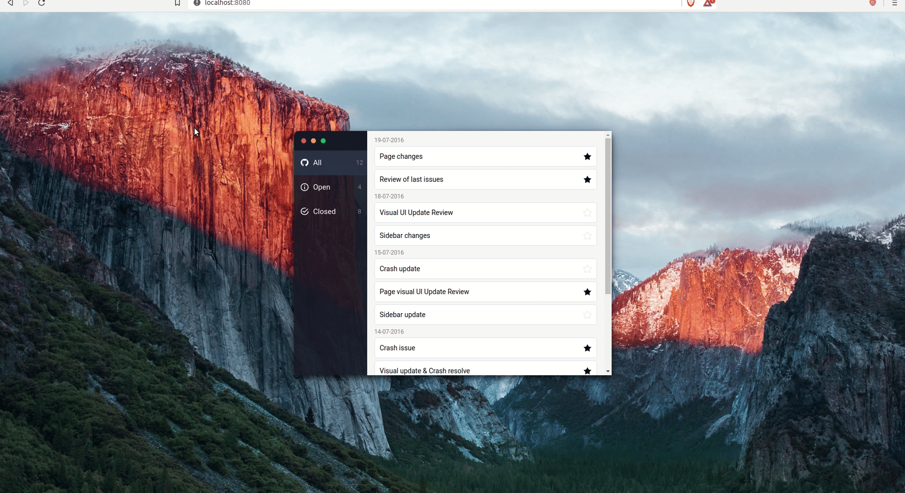

# github-issue-app-ep

## Demo

## Run project

### Prerequisites

- yarn

### Open project

- Run command `yarn install` to install dependencies
- Run command `yarn start` to start project
- Open in browser on [localhost](localhost:8080)
